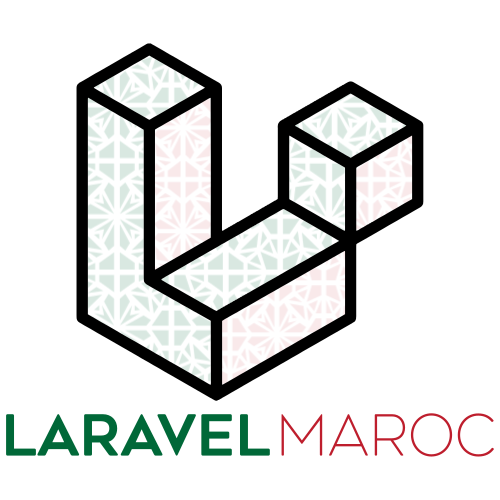

<p align="center">
    
</p>

<p align="center">
    <a href="https://laravel.com">
        
    </a>
    <a href="https://github.com/laravelmorocco/laravelmaroc.com/actions">
        
    </a>
    <a href="https://github.com/laravelmorocco/laravelmaroc.com/actions/workflows/coding-standards.yml">
        
    </a>
</p>

## laravelmaroc.com
Ce dépôt contient le code source du site de [laravelmaroc.com](https://laravelmaroc.com). Laravel Maroc est la plus grande communauté de 
développeurs PHP & Laravel résidant au Maroc.

## Rejoindre la communauté
Vous pouvez rejoindre la communauté ou nous suivre via nos différentes plateformes

[Site Officiel](https://laravelmaroc.com) - [Facebook](https://www.facebook.com/groups/1538696016373740) - [Rejoindre Discord](https://discord.gg/NrzNKM8z)

## Caractéristiques Serveur
The following tools are required in order to start the installation.

- PHP >=8.0
- [Composer](https://getcomposer.org/download/)
- [Yarn](https://yarnpkg.com/getting-started/install)
- [Valet](https://laravel.com/docs/valet#installation)

## Installation
> Notez que vous êtes libre d'ajuster l'emplacement `~/Sites/laravelmaroc` à n'importe quel répertoire de votre choix sur votre machine. Ce faisant, assurez-vous d'exécuter la commande `valet link` dans le répertoire souhaité.

1. Clonez ce repo avec la commande `git clone git@github.com:laravelmorocco/laravelmaroc.com.git ~/Sites/laravelmaroc`
2. Exécuter `composer install` pour installer les dépendances PHP
3. Configurez une base de données locale appelée `laravel_maroc`
4. Exécutez `composer setup` pour configurer l'application
5. Configurer un pilote de messagerie fonctionnel comme [Mailtrap](https://mailtrap.io/) ou [Maildev](https://maildev.github.io/maildev/)
6. Configurez les fonctionnalités (facultatives) ci-dessous

Vous pouvez maintenant visiter l'application dans votre navigateur en visitant [http://laravelmaroc.test](http://laravelmaroc.test). Si vous avez amorcé la base de données, vous pouvez vous connecter à un compte de test avec ** `johndoe` ** & **` password` **.

Une fois que vous avez installé et configuré, pour avoir des dummy data vous devez exécuter la commande
```shell
php artisan db:seed --class=DummyDatabaseSeeder
```

### Github Authentication (optionnel)
Pour que l'authentification Github fonctionne localement, vous devez [enregistrer une nouvelle application OAuth sur Github](https://github.com/settings/applications/new). Utilisez `http://laravelmaroc.test` pour l'URL de la page d'accueil et `http://laravelmaroc.test/auth/github` pour l'URL de rappel. Lorsque vous avez créé l'application, remplissez l'ID et le secret dans votre fichier `.env` dans les variables d'environnement ci-dessous. Vous devriez maintenant pouvoir vous authentifier avec Github.

```shell
GITHUB_ID=
GITHUB_SECRET=
GITHUB_URL=http://laravelmaroc.test/auth/github
```

### Twitter Sharing (optionnel)
Pour permettre le partage automatique des articles publiés sur Twitter, vous devez [créer une application Twitter](https://developer.twitter.com/apps/). Une fois l'application créée, mettez à jour les variables ci-dessous dans votre fichier `.env`. La clé et le secret du consommateur ainsi que le jeton et le secret d'accès se trouvent dans la section «Clés et jetons» de l'interface utilisateur des développeurs Twitter.

```shell
TWITTER_CONSUMER_KEY=
TWITTER_CONSUMER_SECRET=
TWITTER_ACCESS_TOKEN=
TWITTER_ACCESS_SECRET=
```

Les articles approuvés sont partagés dans l'ordre dans lequel ils ont été soumis pour approbation. Les articles sont partagés deux fois par jour à 14h00 et 18h00 UTC. Une fois qu'un article a été partagé, il ne sera plus partagé.

### Notifications Telegram (optionnel)
Laravel Maroc peut notifier les administrateurs des nouveaux articles soumis via Telegram. Pour que cela fonctionne, vous devez configurer un [bot Telegram](https://core.telegram.org/bots) et obtenir un token. Ensuite, configurez le canal sur lequel vous souhaitez envoyer les messages relatifs aux nouveaux articles.

```shell
TELEGRAM_BOT_TOKEN=
TELEGRAM_CHANNEL=
```

## Commands
Command | Description
--- | ---
**`composer pest`** | Exécuter les tests
`php artisan migrate:fresh --seed` | Reset la base de données
`yarn run watch` | Surveillez les changements dans les fichiers CSS et JS

## Maintainers

Le site laravelmaroc.com est actuellement maintenu par [laravelmorocco](https://github.com/laravelmorocco). Si vous avez des questions, n'hésitez pas à créer une issue sur ce dépôt.

## Contribution

Veuillez lire [le guide de contribution](CONTRIBUTING.md) avant de créer une issue ou d'envoyer une demande d'extraction.

## Code de Conduite

Veuillez lire notre [Code de conduite](CODE_OF_CONDUCT.md) avant de contribuer ou d'engager des discussions.

## Vulnérabilités de sécurité

Si vous découvrez une faille de sécurité dans laravelmaroc.com, veuillez envoyer un e-mail immédiatement à [contact@laravelmaroc.com](mailto:contact@laravelmaroc.com). **Ne créez pas de problème pour la vulnérabilité.**

## License

La licence MIT. Veuillez consulter [le fichier de licence](LICENSE.md) pour plus d'informations.
